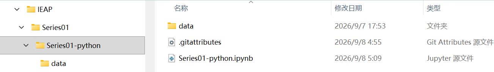

# Git-Series-00
This repository is used to learn the basics of Git and GitHub

# Git-Series-00

## 1. Introduction
This repository is used to learn-by-doing the basics of Git and GitHub for human movement analysis. Before this course, my background in Git and version control was quite basic. I am looking forward to learning more about Git and GitHub because they are essential tools for my future work.

## 2. A Pretty Image from the Internet

## 3. My Motivation to Learn Python, R, and Git
Learning Python, R, and Git will be extremely helpful for my master's degree. Python and R will allow me to analyze complex biomechanical data efficiently. Git will help me organize my projects, keep track of my code history, and collaborate easily with my classmates.

## 4. Local Image Demonstration
